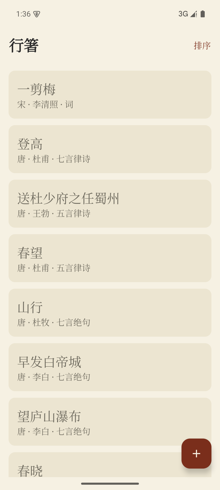
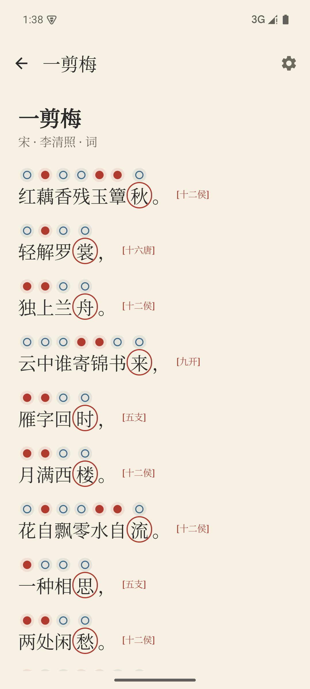

# 行箸 · XingZhu

> 行于诗卷，箸点平仄 —— 一款古诗词平仄 / 韵脚赏析 Android 应用。

「行箸」帮助你阅读古典诗词并理解其**格律**：逐字标注**平仄**、为句末字标注**韵脚**与所属韵部，内置从《诗经》到清词的 **7.6 万余首**公版诗词。

## 功能

- 📚 **本地语料**：内置诗经 / 楚辞 / 曹操集 / 全唐诗（4.3 万）/ 宋词（2.1 万）/ 五代词 / 元曲 / 清词（纳兰），共 7.6 万余首，完全离线可用
- 🔍 **全文搜索**：添加诗词时可按**标题、作者、正文**搜索，结果卡显示命中片段并高亮关键词
- ️📖 **格律标注**：逐字平仄标记（〇 平 / ● 仄 / ？待考），韵脚朱砂圈注并标注《诗韵新编》韵部
- 🗂️ **书架管理**：6 种排序（添加时间、标题/作者首字母、朝代、体裁）+ 按作者分组折叠
- ⚙️ **阅读设置**：显示平仄/韵脚开关、〇● / 平仄记号样式切换、正文字号调节
- 🌐 **数据开源**：语料来自 [chinese-poetry](https://github.com/chinese-poetry/chinese-poetry)（MIT 协议），已做繁转简与清洗

## 截图

| 书架 | 阅读页（平仄/韵脚标注） |
| --- | --- |
|  |  |

## 下载

- 前往 [GitHub Releases](https://github.com/ZhangYet/xingzhu/releases) 下载最新 APK（`xingzhu-release.apk`）

## 构建

环境：JDK 17 + Android SDK（minSdk 26 / targetSdk 35）

```bash
make build        # 构建 debug + release，输出到项目根目录
make install      # 安装 debug 包（多设备时需 SERIAL=<序列号>）
make test         # 运行单元测试
make release      # 仅构建已签名 release 包
```

> release 签名读取 `signing.properties`（不入库）。未配置时产物为 `app-release-unsigned.apk`。

## 模块

- `:app` — Android 应用（Compose、Room、Hilt）
- `:engine` — 纯 Kotlin 标注引擎（诗韵新编平仄 / 韵脚判定，可单测）
- `tools/build_corpus.py` — 语料构建脚本（chinese-poetry → assets）

## 版本

版本号遵循[语义化版本](https://semver.org/lang/zh-CN/)，发布见 [CHANGELOG.md](CHANGELOG.md)。
